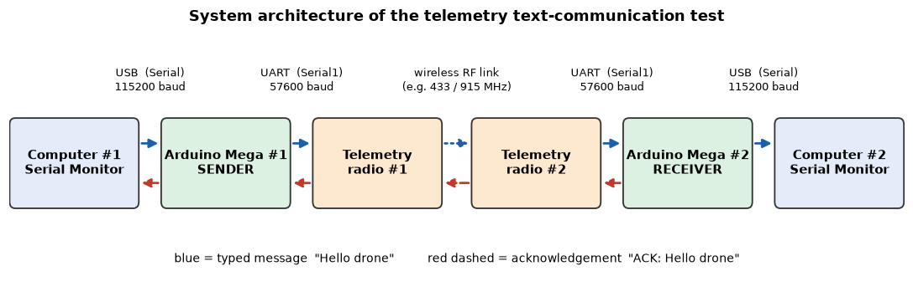
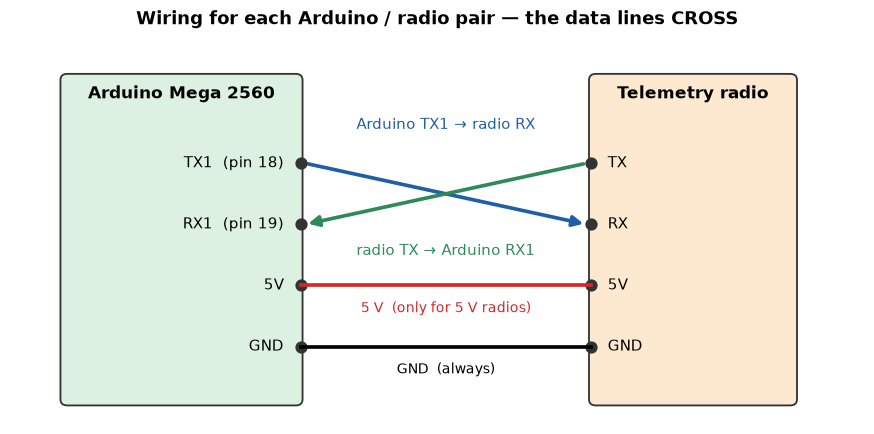

# Arduino Mega + Telemetry Radio — Text Communication Test

Tests the wireless link between two Arduino Mega 2560 boards through two telemetry radios.
Arduino #1 sends text typed in the Serial Monitor; Arduino #2 displays it and sends an
acknowledgement back, proving that communication works in **both directions**.

📘 **Full explanation (theory, code walkthrough, diagrams, troubleshooting):**
[Telemetry_Communication_Explained.ipynb](Telemetry_Communication_Explained.ipynb)



## Sketches

| Folder | Upload to | Purpose |
|---|---|---|
| [`telemetry_sender/`](telemetry_sender/telemetry_sender.ino) | Arduino Mega #1 | reads text from the Serial Monitor, sends it through `Serial1`, verifies the ACK and prints the round-trip time |
| [`telemetry_receiver/`](telemetry_receiver/telemetry_receiver.ino) | Arduino Mega #2 | displays every received message and answers `ACK: <message>` |
| [`telemetry_receiver_status/`](telemetry_receiver_status/telemetry_receiver_status.ino) | Arduino Mega #2 (alternative) | same as the receiver, plus `NO RECENT TELEMETRY DATA` / `DATA RESUMED` link status |

## Hardware

* 2 × Arduino Mega 2560, 2 × USB cables
* 2 × UART telemetry radios configured to talk to each other (e.g. SiK 433/915 MHz, 57600 baud)
* jumper wires; a separate 5 V supply for high-power radios

## Wiring (same for both boards)

| Telemetry radio | | Arduino Mega |
|---|---|---|
| TX  | → | **RX1 — pin 19** |
| RX  | ← | **TX1 — pin 18** |
| GND | — | GND |
| 5V  | — | 5V *(only for 5 V radios)* |

TX always goes to RX — never TX → TX or RX → RX.



## Settings

| Link | Code | Baud |
|---|---|---|
| Arduino ↔ computer | `Serial` | **115200** — set the same in the Serial Monitor |
| Arduino ↔ radio | `Serial1` | **57600** — `#define TELEMETRY_BAUD 57600`, must match the radio's serial speed, same value in both sketches |

Serial Monitor line ending: **Newline**.

## Test procedure

1. Do **not** connect the Pixhawk, motors or ESCs.
2. Wire radio #1 to Mega #1 and radio #2 to Mega #2 (table above). Attach the antennas.
3. Connect both boards by USB. Upload the sender to Arduino #1 and a receiver sketch to Arduino #2
   (*Tools → Board → Arduino Mega or Mega 2560*).
4. Open both Serial Monitors (115200 baud). With one computer, open a second Arduino IDE window for the second board.
5. Type `Hello` in the sender's Serial Monitor and press ENTER.

Expected result:

```text
Arduino #1:
[SENT] Hello
[RECEIVER REPLY] ACK: Hello
[LINK OK] ACK matches the sent text. Round-trip time = ... ms  (1 of 1 messages acknowledged)

Arduino #2:
TELEMETRY CONNECTED / DATA RECEIVED
MESSAGE: Hello
Messages received: 1
```

If all three lines appear (`[SENT]`, `MESSAGE:`, `[RECEIVER REPLY]`) the link works in both directions.

## Troubleshooting

| Symptom | Check |
|---|---|
| Arduino #2 receives nothing | radios powered and linked (green LED solid), TX/RX crossed, common GND, `TELEMETRY_BAUD` = radio serial speed on both boards, same NETID / frequency / air speed |
| random characters (`H%l▒o`) | baud-rate mismatch — change `TELEMETRY_BAUD` on **both** boards |
| Arduino #2 shows the message, Arduino #1 prints `[NO ACK]` | return path: Arduino #2 TX1 (18) → radio #2 RX, radio #1 TX → Arduino #1 RX1 (19) |
| `[WARNING] This ACK does not match…` | corrupted characters: baud rate, loose wires, radio settings |
| text sent only after 1 s | Serial Monitor line ending must be **Newline** |

More details, the UART theory and the baud-mismatch simulation are in the
[notebook](Telemetry_Communication_Explained.ipynb).
