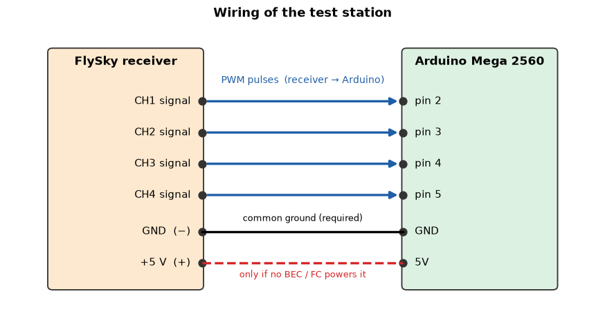

# FlySky FS-i6X + Receiver — Automated Health and Manufacturing Test

The Arduino Mega becomes an automated test station for a FlySky transmitter + PWM receiver. It guides
the operator step by step, measures the receiver's PWM outputs and prints a health report with a
**diagnostic score from 0 to 100**.

📘 **Full explanation (theory, statistics, scoring, simulations, code review):**
[FlySky_Health_Test_Explained.ipynb](FlySky_Health_Test_Explained.ipynb)

> ⚠️ **REMOVE ALL PROPELLERS.** The test switches the transmitter OFF on purpose to observe the failsafe.


## Sketch

[`flysky_health_test/flysky_health_test.ino`](flysky_health_test/flysky_health_test.ino)

## Wiring

| Receiver | Arduino Mega 2560 |
|---|---|
| CH1 signal (roll) | pin 2 |
| CH2 signal (pitch) | pin 3 |
| CH3 signal (throttle) | pin 4 |
| CH4 signal (yaw) | pin 5 |
| GND | GND — **required** |
| +5 V | 5V — only if the receiver has no other power source |

The receiver output mode must be **PWM** (switch *PPM output* off, otherwise CH1 outputs PPM).



## How to run

1. Wire the receiver, remove the propellers, turn the transmitter on.
2. Upload the sketch (*Tools → Board → Arduino Mega or Mega 2560*).
3. Serial Monitor: **115200 baud**, line ending **Newline**.
4. Type a unit ID (e.g. `TX-001`) and press ENTER — or just press ENTER.
5. Follow the prompts: move the requested stick, **hold it**, press ENTER; the Arduino measures automatically.

After the report the program asks for the next unit (no RESET needed).

## Test sequence and score

| Test | What happens | Points |
|---|---|---|
| 1 | initial connection — PWM availability | 10 |
| 2 | neutral: roll / pitch / yaw centered (1400–1600 µs) | 15 |
| 3–6 | end points and travel of roll, pitch, throttle, yaw | 4 × 10 |
| 7 | stability / jitter, sticks untouched | 15 |
| 8 | distance / live-link test: roll moved continuously, ten 2-s *live windows* | 20 |
| 9 | failsafe: throttle at half, transmitter OFF — behavior reported, throttle safety check | not scored |
| 10 | recovery: transmitter ON, roll must follow the stick again | pass / fail |

| Score | Condition |
|---|---|
| 90–100 | EXCELLENT |
| 80–89 | GOOD |
| 65–79 | MARGINAL / INSPECTION REQUIRED |
| < 65 | FAIL / DO NOT USE FOR FLIGHT |

EXCELLENT and GOOD also require a successful recovery and no category with 0 points.
These are diagnostic limits of this procedure — **not** an official FlySky certification or an RF
compliance measurement (PWM outputs do not contain RF power, RSSI, SNR or packet error rate).

## Example report (healthy system, from the host simulation)

```text
FINAL DIAGNOSTIC HEALTH SCORE = 100 / 100
SYSTEM CONDITION:
*** EXCELLENT ***
CSV_RESULT,UNIT-01,100,EXCELLENT,10,15,10,10,10,10,15,20,100.0,998.9,1000.1,999.9,999.7,2.9,100.0,974,10/10,THROTTLE LOW (SAFE),PASS
```

The `CSV_RESULT` line can be pasted into a spreadsheet to compare many units. Test every unit under the
same conditions (distance, antenna orientation, batteries, receiver voltage, environment).

## What was improved

The first version was reviewed, compiled and run in a simulation. Main fixes: a missing signal can no
longer earn travel or stability points, the range test detects a link lost in the middle of the test,
the recovery test requires live stick movement, the failsafe test gives a throttle safety verdict, and
all text is kept in flash memory (RAM use 55 % → 4.9 %). See [../CODE_REVIEW.md](../CODE_REVIEW.md).
