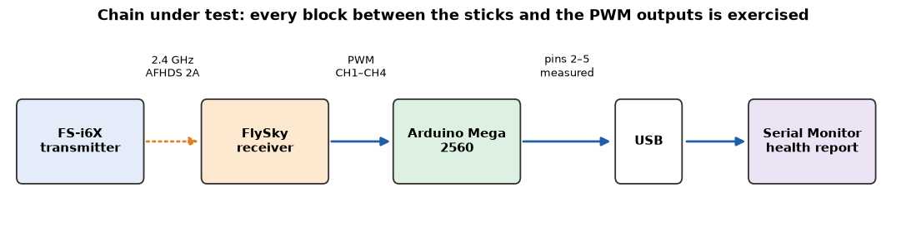

# Remote Control & Receiver Test  Arduino Mega Test Bench

[](https://github.com/mhmdsalemm100/Remote-control-and-receiver-Test-/actions/workflows/ci.yml)

Two bench experiments that verify the radio links of a drone project **before**  any flight hardware
(Pixhawk, ESCs, motors, propellers) is connected. Both use an **Arduino Mega 2560**  and the Arduino IDE
Serial Monitor.

| # | Project | What it tests | Explanation paper (Jupyter) |
|---|---|---|---|
| 1 | [Telemetry radio text communication](01_Telemetry_Radio_Communication) | Two Arduino Megas exchange typed text through two telemetry radios; the receiver sends an acknowledgement back, which proves the link works in **both directions** and measures the round-trip time. | [Telemetry_Communication_Explained.ipynb](01_Telemetry_Radio_Communication/Telemetry_Communication_Explained.ipynb) |
| 2 | [FlySky FS-i6X + receiver health test](02_FlySky_Receiver_Health_Test) | The Arduino measures the receiver's PWM outputs, guides the operator through 10 tests (neutral, end points, stability, distance, failsafe, recovery) and prints a health report with a diagnostic score from 0 to 100. | [FlySky_Health_Test_Explained.ipynb](02_FlySky_Receiver_Health_Test/FlySky_Health_Test_Explained.ipynb) |

<p align="center">
  <br>
  
</p>

---

## Repository structure

Every program is in its  **own file and folder** (the Arduino IDE requires the folder name to match the
`.ino` file name).

```text
.
├── 01_Telemetry_Radio_Communication/
│   ├── README.md                                   wiring, upload, expected output
│   ├── Telemetry_Communication_Explained.ipynb     full explanation (Jupyter paper)
│   ├── telemetry_sender/telemetry_sender.ino       Arduino #1 - SENDER
│   ├── telemetry_receiver/telemetry_receiver.ino   Arduino #2 - RECEIVER
│   ├── telemetry_receiver_status/
│   │   └── telemetry_receiver_status.ino           Arduino #2 - RECEIVER with link status
│   └── images/                                     diagrams generated by the notebook
├── 02_FlySky_Receiver_Health_Test/
│   ├── README.md                                   wiring, procedure, scoring
│   ├── FlySky_Health_Test_Explained.ipynb          full explanation (Jupyter paper)
│   ├── flysky_health_test/flysky_health_test.ino   automated test station
│   └── images/
├── tests/                                          PC simulation tests of the real sketches
├── CODE_REVIEW.md                                  what was checked, found and fixed
├── requirements.txt                                Python packages for the notebooks
└── .github/workflows/ci.yml                        compiles the sketches + runs the tests
```

## Quick start

### Project 1 —  Telemetry text communication

1. Wire each radio to its Arduino Mega: **radio TX → RX1 (pin 19)**, **radio RX → TX1 (pin 18)**, GND → GND, 5V → 5V (5 V radios only).
2. Upload `telemetry_sender.ino` to Arduino #1 and `telemetry_receiver.ino` (or `telemetry_receiver_status.ino`) to Arduino #2.
3. Open both Serial Monitors at **115200 baud**, line ending **Newline**.
4. Type `Hello drone` in the sender's Serial Monitor and press ENTER.

```text
Arduino #1:  [SENT] Hello drone
             [RECEIVER REPLY] ACK: Hello drone
             [LINK OK] ACK matches the sent text. Round-trip time = ... ms
Arduino #2:  TELEMETRY CONNECTED / DATA RECEIVED
             MESSAGE: Hello drone
```

➡ Details: [01_Telemetry_Radio_Communication/README.md](01_Telemetry_Radio_Communication/README.md)

### Project 2 — FlySky receiver health test

> ⚠️ **Remove all propellers.** The test switches the transmitter off on purpose.

1. Wire receiver **CH1–CH4 → pins 2, 3, 4, 5** and **receiver GND → Arduino GND**.
2. Upload `flysky_health_test.ino` to the Arduino Mega.
3. Open the Serial Monitor at **115200 baud**, line ending **Newline**, and follow the instructions.

➡ Details: [02_FlySky_Receiver_Health_Test/README.md](02_FlySky_Receiver_Health_Test/README.md)

## Reading and running the notebooks

GitHub shows the notebooks directly in the browser (with all diagrams). To run them yourself:
 
```bash
pip install -r requirements.txt
jupyter notebook
```
 
## How the code was checked

* **Code review** of every line — all findings and fixes are listed in [CODE_REVIEW.md](CODE_REVIEW.md).
* **Compiled for the Arduino Mega 2560** with `arduino-cli` and all compiler warnings enabled — no warnings:

  | Sketch | Flash | RAM (global variables) |
  |---|---|---|
  | `telemetry_sender` | 6 528 B (2 %) | 390 B (4 %) |
  | `telemetry_receiver` | 5 432 B (2 %) | 369 B (4 %) |
  | `telemetry_receiver_status` | 7 270 B (2 %) | 387 B (4 %) |
  | `flysky_health_test` | 24 650 B (9 %) | 399 B (4 %) |

* **Simulation tests on a PC** ([tests/](tests)): the real `.ino` files run against a simulated radio link
  and a simulated transmitter/receiver with a "virtual operator" — 11 telemetry tests and 12 FlySky
  scenarios, including broken wires, lost links and different failsafe modes. Run them with:
 
  ```bash
  make -C tests
  ```

* **Continuous integration**: every push compiles all sketches for `arduino:avr:mega` and runs the simulation tests.

## Safety

* First test the radio links on the bench, **without** Pixhawk, ESCs, motors or propellers.
* Always connect the antennas before powering a radio.
* Check the supply voltage of every module before connecting it to the Arduino's 5V pin.
* Add other systems one at a time, only after the basic links work.

## License

[MIT](LICENSE)
